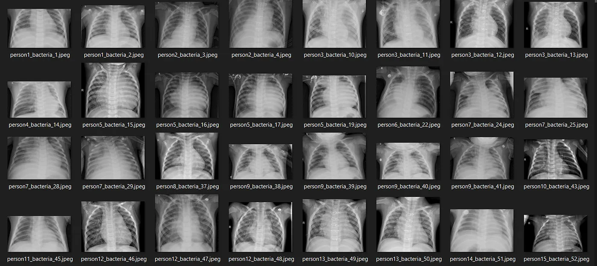

[Credit: Medium.com](https://becominghuman.ai/pneumonia-detection-using-cnn-ac52873a2d1e)

# Model for Pneumonia Analysis

**Author: <a href="https://www.linkedin.com/in/karina-basto-eyzaguirre-203a0445/"> Karina Basto-Eyzaguirre</a>**

## Business Understanding
Pneumonia remains a global crisis, especially for children under five, claiming over 700,000 lives annually. The traditional manual review of chest X-rays by experts is time-consuming, creating bottlenecks and delaying critical treatment. Our model aims to automate the initial screening of pediatric X-rays, freeing up experts and boosting efficiency, ultimately leading to faster diagnoses and better child health outcomes.

Crucially, our model design prioritizes minimizing false negatives (missed pneumonia) as these are virtually intolerable, potentially leading to severe complications or death. While false positives (incorrect flags) are more tolerable, as they still reduce workload by identifying cases for expert review. Therefore, our primary evaluation metric is recall, aiming to maximize true pneumonia identification. We balance this with overall accuracy, ensuring high sensitivity to pneumonia while providing a meaningful reduction in X-ray review workload for healthcare professionals.

## Data Understanding
For this analysis, we utilized the  <a href="https://data.mendeley.com/datasets/rscbjbr9sj/3">Large Dataset of Labeled Optical Coherence Tomography (OCT) and Chest X-Ray Images</a> from Mendeley Data, specifically focusing on its Chest X-Ray component. This dataset includes 5,863 pediatric chest X-ray images. The data is pre-sorted into train, validation, and test sets with 'NORMAL' and 'PNEUMONIA' labels, making it suitable for training our CNN.                                                                                                                                                                                                                                                 
## Data Preparation
Effective data preparation is crucial for robust deep learning models. Our process begins with importing libraries, downloading the dataset, and defining directories. 

Then we move into Exploratory Data Analysis (EDA) which comprises of four key parts: 
1. Class Distribution Analysis to identify and address imbalances
2. Sample Image Visualization for qualitative understanding
3. Image Size Analysis to standardize inputs to 256x256 pixels for the CNN
4. Data Augmentation via vertical flipping to increase data variety and improve model generalization, chosen for its simplicity and biological plausibility in X-rays.

## Modelling and Evaluation
Thi project's modeling phase involved constructing a custom Convolutional Neural Network (CNN) architecture designed for image classification. This CNN was compiled using the Adam optimizer and binary cross-entropy loss, then trained using ImageDataGenerator with and without data augmentation.  Various model configurations were compared and model training incorporated callbacks like Early Stopping to prevent overfitting and Model Checkpoint to save the best performing model.

For Model Evaluation, a comprehensive approach was taken. Beyond standard metrics like accuracy, a custom function was used to calculate Precision, Recall, and F1-score, along with a full confusion matrix. Crucially, an optimal threshold optimization strategy was applied on our best performing model. This function iterated through various prediction probability thresholds to identify the point that best balanced the F1-score, aligning with the project's priority of maximizing true positive identification (recall) while maintaining acceptable false positives.

## Recommendations
Based on our analysis we will recommend to hospital and clinics integrating our optimized Fusion CNN model v2, set with a threshold of 0.9996. This model will be ideal for clinics and hospitals with high volumes of juvenile pneumonia suspects. As our model can screens chest X-rays to identify pneumonia, medical experts then can focus on the model flagged positives, freeing up human resources for faster patient care. Negative classifications allow immediate pursuit of alternative diagnoses, while confirmed positives facilitate quick treatment initiation.

The reason why this is the best is because it offers:

- Superior Patient Safety & Risk Mitigation: With 94.10% Recall (only 23 missed cases), this model minimizes missed pneumonia diagnoses, reducing complications and liabilities.
- Optimized Resource Utilization: 83.79% Precision means fewer false alarms (71 cases), minimizing wasted diagnostic effort and enabling medical teams to focus on genuine needs.
- Balanced & Reliable Performance: An F1-Score of 0.8865 and 84.94% overall Accuracy ensure a robust, trustworthy solution for efficient clinical operations.

#### Limitations of the analysis
- Limited Generalizability: The dataset's exclusive focus on "pediatric chest X-ray images" from a single institution severely limits the model's generalizability with adult patiens and introduces biases to the institution protocals and demographics.
- Information Loss: Resizing X-ray images to 256x256 pixels discards crucial high-frequency details needed for accurate pneumonia identification.
- Absence of Clinical Metadata: Lack of patient context (age, gender, symptoms) limits the model's robustness, interpretability, and real-world diagnostic utility.

## For More Information:
See the full analysis in the <a href="https://github.com/KBE25/pneumonia_diagnosis/blob/main/notebook.ipynb">Jupyter Notebook</a>.
The business information can also be found in <a href="">this presentation. </a>

For additional info, contact Karina Basto-Eyzaguirre at karinabastoe@gmail.com.

### Repository Structure
- <a href="https://github.com/KBE25/pneumonia_diagnosis/tree/main/image"> image </a>
- <a href="https://github.com/KBE25/pneumonia_diagnosis/blob/main/.gitignore"> .gitignore </a>
- <a href="https://github.com/KBE25/pneumonia_diagnosis/blob/main/README.md"> README.md </a>
- <a href="https://github.com/KBE25/pneumonia_diagnosis/blob/main/notebook.ipynb"> notebook.ipynb </a>
- <a href=""> presentation </a>

### Resources
- <a href="https://data.mendeley.com/datasets/rscbjbr9sj/3">Large Dataset of Labeled Optical Coherence Tomography (OCT) and Chest X-Ray Images</a>
- <a href="https://data.unicef.org/topic/child-health/pneumonia/"> Child Health Pneumonia</a>
- <a href="https://thepathologist.com/issues/2024/articles/oct/persisting-challenges-in-pneumonia-diagnostics"> Persisting challenges in pneumonia diagnostics</a>
- <a href="https://www.damoreinjurylaw.com/blog/pneumonia-misdiagnosis-conditions-its-mistaken-for-consequences/">Pneumonia misdiagnosis conditions its mistaken for consequences</a>
- <a href="https://timesofindia.indiatimes.com/life-style/health-fitness/health-news/understanding-pneumonia-complications-and-the-risks-of-late-diagnosis/articleshow/107032659.cms"> Understanding pneumonia complications and the risks of late diagnosis</a>